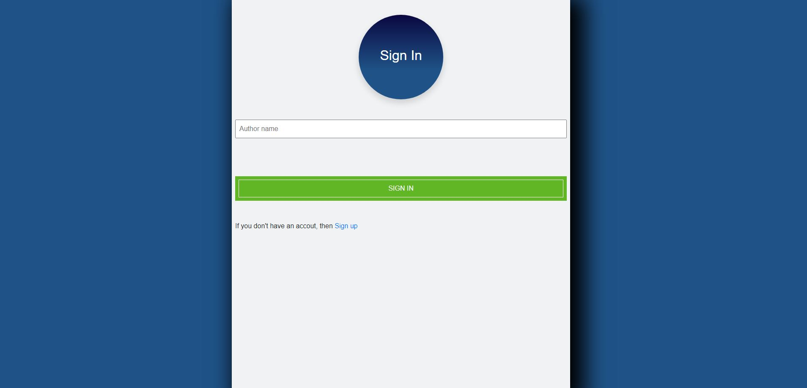
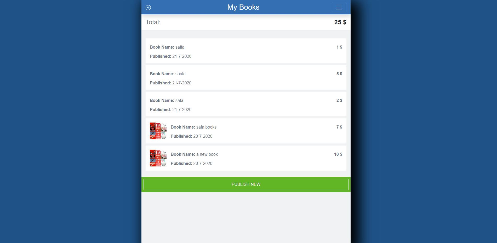

# Book Store

> This is the capstone project of the Microverse Ruby on Rails curriculum. This capstone project is completed as part of the Microverse remote software developement curriculum using the pair programming approach.

## Check Video Link

[Description Video](https://www.loom.com/share/ef3f7a167bf443b396eba32408f12a3b)

## Create an author account

## Sign in

## Profile

## Publish a new book

## View categories

## View books

## Built With

- Ruby,
- Rails,
- HTML,
- CSS,
- Bootstrap

## Live Demo

[Live Demo Link](https://salty-wildwood-28317.herokuapp.com/)

### Prerequisites

-Ruby: 2.6.3 Rails: 5.2.3

### Install and Setup

-Clone repo to your local
> git clone < address >

-Install gems with:
> bundle install

-Setup database with:
> rails db:create

> rails db:migrate

### Usage

-Start server with:
> rails server

Open http://localhost:3000/ in your browser.

### Run tests
-Run:
> rpsec --format documentation

## Author

👤 **Safa ERDEN**

- Github: [@SafaErden](https://github.com/SafaErden)
- Twitter: [@safaerden](https://twitter.com/safaerden)
- Linkedin: [SafaErden](https://www.linkedin.com/in/safaerden/)
- Mql5: [safaerden](https://www.mql5.com/en/users/safaerden)
- Email: [safaerden](mailto:safaerden@gmail.com)

## 🤝 Contributing

Contributions, issues and feature requests are welcome!

Feel free to check the [issues page](https://github.com/SafaErden/Book-Store/issues)

## Show your support

Give a ⭐️ if you like this project!

## Acknowledgments

You can access all the design info (color, typography, layouts) in this link:

[Design](https://www.behance.net/gallery/19759151/Snapscan-iOs-design-and-branding?tracking_source=)

Design idea by [Gregoire Vella on Behance](https://www.behance.net/gregoirevella)
